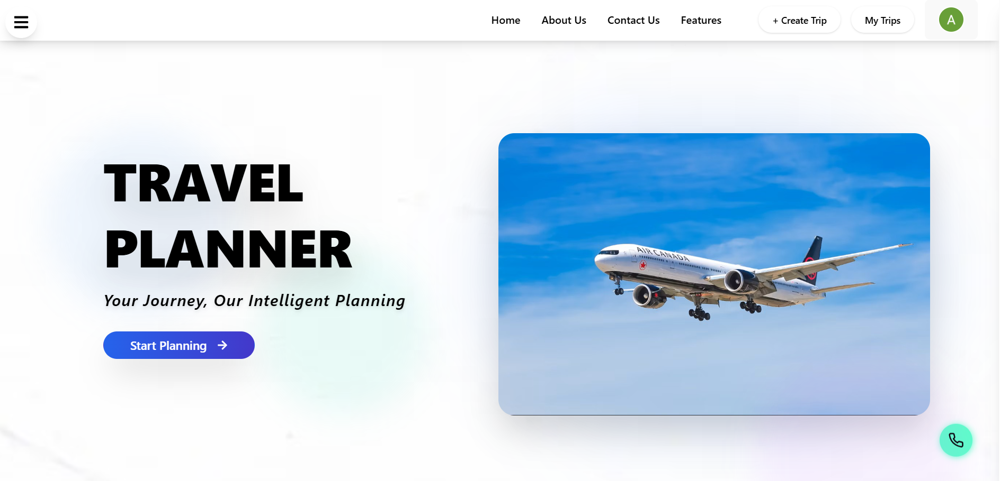

#  Travel Planner: LLMs and Services for Smart Itinerary Generation

**Team Members:**  
Sundaram, Sambhav Mishra, Aggimalla Abhishek, Nenavath Likhith Naik  
**Faculty Guide:** Snehalatha S H, Animesh Chaturvedi  
**Department of Data Science and Artificial Intelligence**  
**Indian Institute of Information Technology, Dharwad**  
Dharwad, Karnataka, India  


[](https://your-vercel-deployment-url.vercel.app)


---


##  Project Overview

**Travel Planner** is a full-stack web application that revolutionizes the way users plan their trips.  
Traditionally, travelers rely on multiple platforms—flights, hotels, maps, weather forecasts—which makes planning fragmented and time-consuming.  
Our system introduces an **AI-powered solution using Google’s Gemini LLM**, enabling **smart, personalized, and automated itinerary generation**.

Through natural language prompts such as *destination*, *duration*, *budget*, and *preferences*, users can generate a **structured, day-by-day itinerary** that integrates **real-world data** like maps and weather.  

This project was developed as a **college group project** under the Department of Data Science and AI, IIIT Dharwad.

---

##  Key Features

- **AI-Powered Itinerary Generation** – Uses **Google Gemini LLM** to understand user preferences and create contextual, realistic travel plans.  
- **Smart Personalization** – Generates custom recommendations based on user budget, travel type, and interests.  
- **Real-Time Data Integration** – Connects with **Google Maps** and **Weather APIs** for up-to-date route and weather information.  
- **Dynamic Updates** – Automatically adjusts itineraries using live data to ensure practical travel schedules.  
- **User Authentication** – Powered by **Firebase Auth** for secure login and personalized trip storage.  
- **Scalable Architecture** – Modular frontend–backend design ensures flexibility and easy future expansion.  
- **Responsive UI** – Built with **React**, **Vite**, and **Tailwind CSS** for a smooth experience across all devices.  

---

##  System Architecture

The system follows a **three-tier architecture** — *Frontend, Backend, and External Services.*

###  Frontend  
- Developed with **React.js (Vite)** and **Tailwind CSS**.  
- Provides an intuitive interface where users enter trip details and view AI-generated itineraries.  
- Integrated with **Firebase Authentication** for secure access.  
- Deployed seamlessly on **Vercel**.

###  Backend  
- Built using **Node.js** for efficient request handling.  
- Communicates with:
  - **Gemini API** – for itinerary generation and reasoning.  
  - **Firebase Firestore** – for storing user and trip data.  
  - **Weather API** – for fetching live climate details.  
- Implements input validation, caching, and concurrency handling for optimized performance.

###  External Services  
- **Google Gemini LLM** – Core reasoning and content generation engine.  
- **Google Maps API** – Provides location and navigation data.  
- **Weather API** – Supplies real-time forecast integration.  
- **Firebase Auth & Firestore** – Secure user management and cloud storage.

---

##  Tech Stack

| Category | Technologies |
|-----------|---------------|
| **Frontend** | React.js, Vite, Tailwind CSS |
| **Backend** | Node.js, Express.js |
| **Database** | Firebase Firestore |
| **AI Model** | Google Gemini API |
| **APIs** | Google Maps, Weather API |
| **Auth & Hosting** | Firebase, Vercel |
| **Dev Tools** | ESLint, PostCSS |

---

## 🗂️ Folder Structure

```bash
TRAVEL_PLANNER/
├── node_modules/ # Project dependencies
├── public/ # Static assets (images, icons, HTML)
├── src/
│ ├── assets/ # Icons, fonts, and visuals
│ ├── components/ # Reusable UI components
│ ├── constants/ # Configuration and constants
│ ├── create-trip/ # Module for trip creation
│ ├── hooks/ # Custom React hooks
│ ├── my-trips/ # User’s saved trips
│ ├── pages/ # App pages
│ ├── service/ # API and LLM service handlers
│ ├── view-trip/ # Detailed trip view
│ ├── App.jsx # Root component
│ ├── App.css # Global styles
│ └── main.jsx # Entry point
├── .env.local # Environment variables
├── package.json # Project dependencies and scripts
├── tailwind.config.js # Tailwind configuration
├── vite.config.js # Vite configuration
└── vercel.json # Deployment settings

```
##  Installation and Setup

### **Prerequisites**
- Node.js (v18 or higher)  
- npm or yarn

### **Setup Instructions**
```bash

git@github.com:SambhavMishra8319/Travel-Plannar.git
cd travel-planner
npm install
npm run dev

```
### Environment Variables

Create a .env.local file in the project root:
```bash

VITE_GOOGLE_AUTH_CLIENT_ID=your_google_auth_client_id_here
VITE_GOOGLE_AUTH_REDIRECT_URI=your_google_auth_redirect_uri_here
VITE_GOOGLE_PLACE_API_KEY=your_google_places_api_key_here
VITE_GOOGLE_GEMINI_API_KEY=your_google_gemini_api_key_here

```
##  Research Background

This project builds upon recent advances in **Large Language Models (LLMs)** and **AI-driven personalization**.  
It explores how generative AI (like **Gemini**) can understand user context and produce coherent, multi-day travel itineraries automatically.

Compared to traditional tools like **MakeMyTrip** or **Expedia**, which primarily focus on bookings, our system emphasizes **planning intelligence** — combining AI reasoning with live data sources.

---

##  Performance Evaluation

| Metric                | Before Optimization | After Optimization | Improvement |
|------------------------|--------------------:|-------------------:|-------------:|
| API Response Time      | 850 ms              | 220 ms             | 74%          |
| Database Query Time    | 420 ms              | 95 ms              | 77%          |
| Concurrent Users       | 50                  | 250                | 400%         |
| Memory Usage           | 45 MB               | 28 MB              | 38%          |

---

##  Comparison with Existing Platforms

| **Feature**                    | **Travel Planner** | **MakeMyTrip** | **Expedia** | **Yatra** |
|--------------------------------|--------------------|----------------|--------------|------------|
| AI-Generated Itinerary         | Available          | Not Available  | Not Available | Not Available |
| Real-Time Weather Integration  | Advanced           | Basic          | Basic         | Not Supported |
| Cost Estimation                | Detailed           | Basic          | Moderate      | Not Supported |
| Collaboration & Group Planning | Supported          | Not Available  | Not Available | Not Available |
| Booking APIs (Flights + Hotels)| Integrated         | Supported       | Supported     | Supported |

##  Future Enhancements

- **Predictive Analytics** – Suggest best travel times and deals using data-driven insights.  
- **AR Integration** – Overlay landmark information and translations in real time.  
- **Social & Gamified Features** – Enable trip sharing, badges, and collaborative planning.  
- **Sustainability Metrics** – Display carbon footprint and eco-friendly suggestions.  
- **Advanced LLM Memory** – Enable context retention for returning users.  

---

##  Limitations

- Dependence on third-party APIs (Google, Weather) for data integrity.  
- Current model uses general-purpose LLM (**Gemini**) without domain-specific fine-tuning.  
- Limited real-world user testing — future iterations aim for larger-scale evaluation.  
- Potential for minor inaccuracies in generated itineraries due to generative variability.  

---

##  Conclusion

**Travel Planner** demonstrates how **LLMs** and **AI services** can transform trip planning into an intelligent, interactive, and effortless experience.  
By integrating modern web technologies with **generative AI**, the system bridges the gap between **research and real-world usability**, offering travelers a **personalized planning assistant** that adapts to their needs.  

This project establishes a strong foundation for future work in **LLM-powered personalization**, **conversational travel agents**, and **AI-based decision-making systems**.
